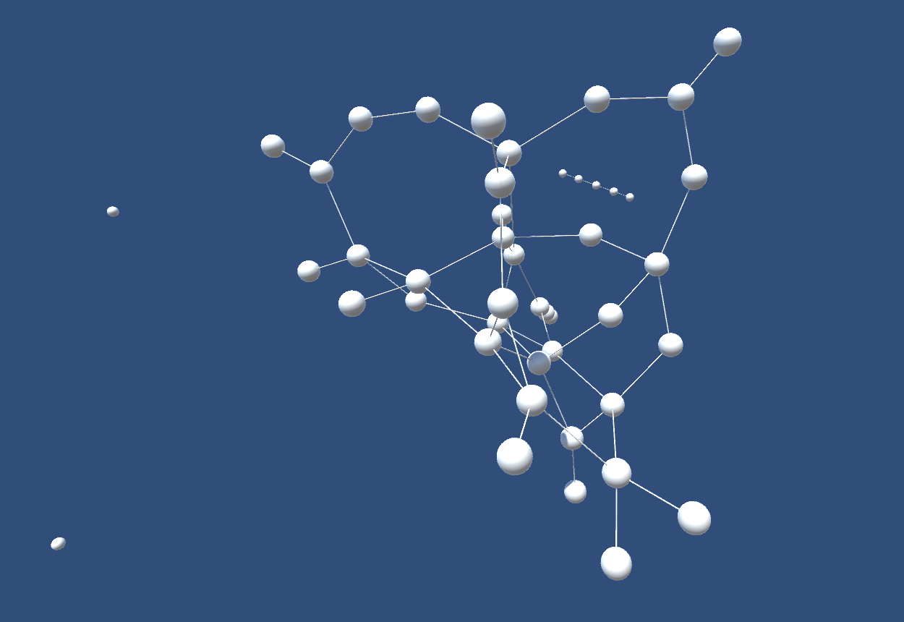

### GPU accelerated 3D Force Directed Graph using ComputeSharp.  

### Usage for existing set of data to graph:  

Enter a path to either an existing sqlite db:

The sqlite db must have a `nodes` table with the following columns:  
- id (int)  
- position_x (float)  
- position_y (float)  
- position_z (float)  

It must also have an `edges` table with the following columns:  
- id (int)  
- node1 (int)  
- node2 (int)  

Example command line for existing:  
-i is the number of iterations to run the force directed graph algorithm  
-k is the spring constant (must be between 0 and 1)  
-e is the repulsion constant

`C:\Users\<username>\Desktop\db-with-node-and-edge-tables.db -i=50`  

### Usage for a demo random graph:

Example command line for random:
-n is the number of nodes to generate
-c is the number of connections to generate  

`demoGraph C:\Users\<username>\Desktop\rand.db -i=50 -n=500 -c=700`  

This application uses ComputeSharp: https://github.com/Sergio0694/ComputeSharp  

Picture generated with https://github.com/atonalfreerider/Unity-FDG